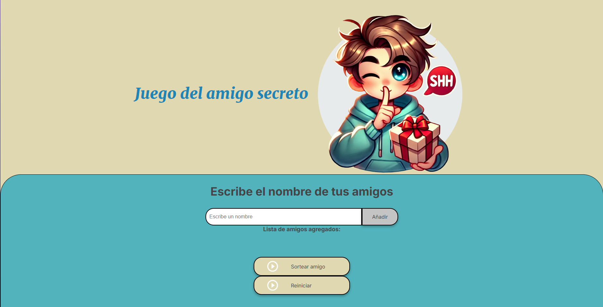

# challenge-amigo-secreto_esp-main
#  Amigo Secreto

Este es un proyecto web para organizar un sorteo de "Amigo Secreto", donde los participantes pueden ingresar sus nombres y hacer un sorteo aleatorio.

##  Tecnologías utilizadas
- HTML5
- CSS3
- JavaScript (Vanilla)

##  Captura de pantalla


##  Instalación
1. Clona este repositorio:
   ```sh
   git clone https://github.com/tu-usuario/challenge-amigo-secreto_esp-main
.git
2. Abre index.html en tu navegador.

## 🎮 Cómo usar
1. Ingresa los nombres de los participantes.
2. Presiona "Añadir" para agregarlos a la lista.
3. Presiona "Sortear amigo" para obtener un resultado aleatorio.
4. Usa "Reiniciar" para limpiar la lista.